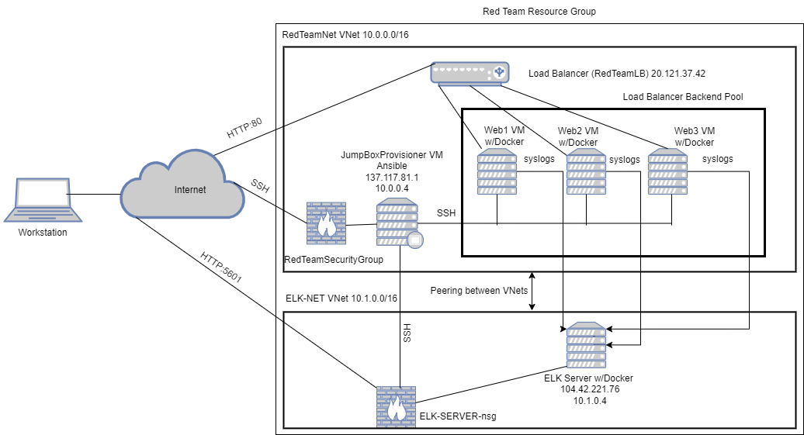
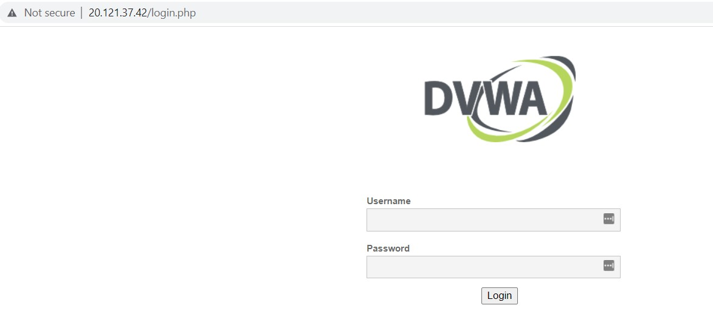
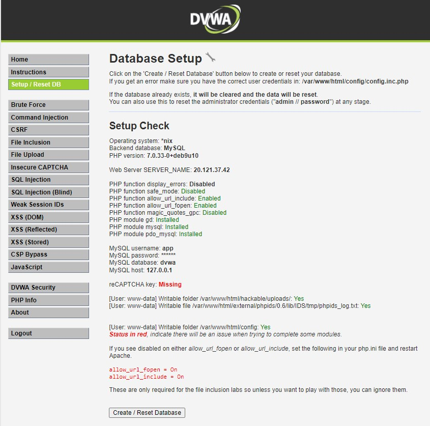

# ELK Stack Deployment Project

The following is a complete walkthrough guide in how to deploy a simple virtual network with an ELK Stack server. 
The purpose of the project was to simulate a live environment with potentially vulnerable web applications. Additionally,
the project demonstrates how to use the ELK Stack to aggregate and view log data from multiple servers. 

Key highlights from the project included in this document:
- Diagram and Description of Network Topology
- Load Balancing
- Access Policies
- Automated Deployment and Configuration with Ansible
- ELK Stack Configuration
  - Monitored servers
  - Beats utilized
 
### Diagram and Description of Network Topology

  


The main purpose of this network is to simulate a network hosting vulnerable web applications in order to learn how ELK can be used to monitor traffic to those web applications. 

Table 1 - Summary of server names and details
| Name     |   Function  | IP Address |  Operating System  |
|----------|-------------|------------|--------------------|
| Jump Box | Provisioner | 10.0.0.4   | Linux Ubuntu 18.04 |
| Web1     | Web Server  | 10.0.0.5   | Linux Ubuntu 18.04 |
| Web2     | Web Server  | 10.0.0.6   | Linux Ubuntu 18.04 |
| Web3     | Web Server  | 10.0.0.7   | Linux Ubuntu 18.04 |
| ELK      | Monitoring  | 10.1.0.4   | Linux Ubuntu 18.04 |

## Load Balancing

In addition to the above, a **load balancer** was placed in front of the web servers. The load balancer's targets are organized into the following availability zones:

**Red Team Availability Set**: Web1-Web2-Web3

One of the most important aspects of securing a network is ensuring it's **Availability**. The availability of network resources is a key component of the CIA triad. Load balancing and redundancy are two ways to increase the uptime of network resources. In this network, several redundant web servers were created behind a load balancer. They were grouped together logically in a backend pool. This means if one of the web servers were taken down, another instance can immediately receive traffic from the load balancer. In addition to creating this concept of failover, the load balancer can spread the traffic to multiple servers should the network be flooded with traffic. This is especially useful in mitigating the risk of a distributed denial-of-service attack (DDOS).

## Access Policies
**Confidentiality** is another key component of the CIA triad. Confidentiality refers to the cybersecurity measures surrounding access controls to data and network resources. 
In Azure, this is accomplished with Network Security Groups. For this network most of the security controls for access to the jump box and the web servers were managed by RedTeamSecurityGroup. To harden the system a rule was created that only allowed web traffic to the jump box for system administration. The administrator's Public IP address 
was added to the rule to ensure only traffic from this IP address could access the jump box. Additionally, all of the machines in the network were configured to allow SSH access for network administration. We added security to this potential vulnerability by only allowing SSH from machines with allowed public SSH keys. Finally, we added a rule that only
SSH access from the jump box to the web servers was permitted. 

The ELK server was created in it's own virtual network. As a result, a separate security group was created to manage traffic to and from the ELK server. A rule was created to 
allow web traffic from the administrator's IP to the ELK server to view the aggregated log data in **Kibana**. Access via SSH was also permitted on the ELK server. Public SSH keys from the administrator account were added to increase security around SSH access. 


## Automated Deployment and Configuration Using Ansible
For this network, the Ansible container was downloaded to the jump box to serve as a provisioner for the network. **Containers** are simplified virtual machines that are dedicated to one task. Multiple containers can share the resources and operating system of a virtual machine. This way we could deploy apps and configure servers using Ansible playbooks. **Ansible playbooks** use YML (YAML Ain't Markup Language) files in order to create a series of commands to be executed on multiple servers. This automation tool reduced deployment and configuration time in this small set up of only four severs and would be extremely powerful in a network of hundreds or thousands of servers. Finally, we utilized **Docker** to create and manage our containers. 

The commands to install Docker and then use Docker to create the Ansible container:

1. Install Docker: `sudo apt update` then `sudo apt install docker.io`

2. Check Docker status: `sudo systemctl status docker` or Start Docker status: `sudo systemctl start docker`

3. Pull the Ansible container: `sudo docker pull cyberxsecurity/ansible`

4. Launch the Ansible container: `docker run -ti cyberxsecurity/ansible:latest bash` 

Once the Ansible container is deployed on the jump box you can SSH to the jump box and connect to the container with the following commands:
1. List all containers: `docker container list -a` the Ansible container will be given a randomized name. 

2. Start the container: ```bash $ sudo docker start container_name``` Linux will confirm the name of the container started.

3. Connect to the container using attach: ```bash $ sudo docker attach container_name``` Linux will show you have connected by giving root access prompt. 

The next step to take before running Ansible playbooks to deploy the web application to the web servers is to configure the Ansible host file and the ansible.cfg file. The hosts file is where to compile the list of servers Ansible will deploy to. The configuration file, ansible.cfg is where the system administrator login credentials will be configured. 

Run `cd /etc/ansible` and then `ls` to show all the files:

    ```bash
    root@containerID:~# cd /etc/ansible/
    root@containerID:/etc/ansible# ls
    ansible.cfg  hosts
    ```
Use Nano to open the `ansible.cfg` file: `root@containerID:/etc/ansible# nano ansible.cfg`

- This setting  is to be changed is the `remote_user`. The default admin user name is "root". Replace this with the admin user name used to set up the VMs. 

    ```bash
    # What flags to pass to sudo
    # WARNING: leaving out the defaults might create unexpected behaviors
    #sudo_flags = -H -S -n

    # SSH timeout
    #timeout = 10

    # default user to use for playbooks if user is not specified
    # (/usr/bin/ansible will use current user as default)
    remote_user = YOUR_USER_NAME

    # logging is off by default unless this path is defined
    # if so defined, consider logrotate
    #log_path = /var/log/ansible.log

    # default module name for /usr/bin/ansible
    #module_name = command
    ```

Next use Nano to edit the IP addresses in the hosts file: `root@containerID:/etc/ansible# nano hosts`

Hosts can be grouped together under headers using brackets: `[webservers]` or `[databases]` or `[workstations]`

- Uncomment the `[webservers]` header line and add the IP addresses of all of the web servers: `10.0.0.5, 10.0.0.6, 10.0.0.7`

Ansible works by creating a python script and then runs that script on the target machine using that machine's installation of Python. Typically, Ansible may have issues determining which python to use on the target machine, but this is solved by forcing ansible to use python 3.

- Add the line: `ansible_python_interpreter=/usr/bin/python3` besides each IP address.

 ```bash
    # This is the default ansible 'hosts' file.
    #
    # It should live in /etc/ansible/hosts
    #
    #   - Comments begin with the '#' character
    #   - Blank lines are ignored
    #   - Groups of hosts are delimited by [header] elements
    #   - You can enter hostnames or ip addresses
    #   - A hostname/ip can be a member of multiple groups
    # Ex 1: Ungrouped hosts, specify before any group headers.

    ## green.example.com
    ## blue.example.com
    ## 192.168.100.1
    ## 192.168.100.10

    # Ex 2: A collection of hosts belonging to the 'webservers' group

    [webservers]
    ## alpha.example.org
    ## beta.example.org
    ## 192.168.1.100
    ## 192.168.1.110
    10.0.0.5 ansible_python_interpreter=/usr/bin/python3
    10.0.0.6 ansible_python_interpreter=/usr/bin/python3
    10.0.0.7 ansible_python_interpreter=/usr/bin/python3
 ```

The next task is to create an Ansible playbook that installed Docker and configure all of the virtual web servers with the DVWA web app. This is done by using nano to create a yml file in the ansible directory in the Ansible container:
 ```bash
  root@container_ID:~# nano /etc/ansible/playbook-name.yml
  ```
This is the yml code used to install Docker and create the DVWA containers:

```bash
---
- name: configure web vms with docker
  hosts: webservers
  become: true
  tasks: 

  - name: docker.io 
    apt:
      update_cache: yes
      name: docker.io
      state: present

  - name: install pip3  
    apt: 
      name: python3-pip
      state: present

  - name: Install Python Docker Module
    pip:
      name: docker
      state: present

  - name: download and launch our DVWA web container
    docker_container: 
      name: dvwa
      image: cyberxsecurity/dvwa
      state: started
      restart_policy: always
      published_ports: 80:80   

  - name: enable docker service 
    systemd: 
     name: docker
     enabled: yes
   ```
   
 The final step is to run the playbook using the ansible-playbook command: ```bash ansible-playbook playbook-name.yml```
 Running this playbook executes all of the commands in the playbook on each server identified in the hosts file in the ansible directory.
 If run successfully, the output appears as follows:
 
 ```bash
    root@container_ID:~# ansible-playbook /etc/ansible/playbook-name.yml

    PLAY [Config Web VM with Docker] ***************************************************************

    TASK [Gathering Facts] *************************************************************************
    ok: [10.0.0.5]
    ok  [10.0.0.6]
   
    TASK [docker.io] *******************************************************************************
    [WARNING]: Updating cache and auto-installing missing dependency: python-apt
    changed: [10.0.0.5]
    changed: [10.0.0.6]

    TASK [Install pip3] *****************************************************************************
    changed: [10.0.0.5]
    changed: [10.0.0.6]

    TASK [Install Docker python module] ************************************************************
    changed: [10.0.0.5]
    changed: [10.0.0.6]

    TASK [download and launch a docker web container] **********************************************
    changed: [10.0.0.5]
    changed: [10.0.0.6]

    PLAY RECAP *************************************************************************************
    10.0.0.5                   : ok=6    changed=5    unreachable=0    failed=0    skipped=0    rescued=0    ignored=0 
    10.0.0.6                   : ok=6    changed=5    unreachable=0    failed=0    skipped=0    rescued=0    ignored=0  
  ```
 
Now you can use the administrators machine with the IP address that is allowed to access the RedTeamSecurityGroup to test the deployment. Because the web servers hosting the DVWA do not have a public IP and are behind a load balancer, the web app is accessed using the IP of the load balancer. 



The login credentials for the DVWA are ```admin:password``` 
Upon successful login, the user will see a page similar to the one below. Click the  to set up the DVWA web application. 




## ELK Server Configuration

Previous sections covered ELK Server creation and configuration in Azure. Under the same resource group, a new virtual network (VNet) was created for the ELK Server and the ELK-SERVER-nsg (network security group). Then a **Peering** was created between the two networks in order to share traffic. 

This section will cover deploying the ELK Server image using Ansible. 

The ELK Stack is an open-source software platform that includes three powerful tools: Elasticsearch, Logstash, and Kibana. 
 - Logstash aggregates data from multiple sources, generally log data and sends it to Elasticsearch. 
 - Elasticsearch is a search and analytics engine used as centeralized data pool.
 - Kibana creates visulizations of that data in multiple views, graphs and charts. 

Security analysts can utilize an integrated ELK server to:
 - Monitor the vulnerable web applications
 - Detect changes to the file systems of the VMs on the network using Filebeats
 - Watch system metrics such as, CPU usage, attempted SSH logins, `sudo` escalation failures using Metricbeats.

The steps to connect to the Ansible container described above are repeated to navigate to the ansible directory. Additionally, the host file must be updated with the IP address for ELK server. Separate from the ```[webservers]``` header in the hosts file, an ```[ELK]``` section is created:

```bash
# This is the default ansible 'hosts' file.
#
# It should live in /etc/ansible/hosts
#
#   - Comments begin with the '#' character
#   - Blank lines are ignored
#   - Groups of hosts are delimited by [header] elements
#   - You can enter hostnames or ip addresses
#   - A hostname/ip can be a member of multiple groups

# Ex 1: Ungrouped hosts, specify before any group headers.

#green.example.com
#blue.example.com
#192.168.100.1
#192.168.100.10

# Ex 2: A collection of hosts belonging to the 'webservers' group

[webservers]
10.0.0.5 ansible_python_interpreter=/usr/bin/python3
10.0.0.6 ansible_python_interpreter=/usr/bin/python3
10.0.0.7 ansible_python_interpreter=/usr/bin/python3

[ELK]
10.1.0.4 ansible_python_interpreter=/usr/bin/python3

#beta.example.org
#192.168.1.100
#192.168.1.110

# If you have multiple hosts following a pattern you can specify
# them like this:

#www[001:006].example.com

# Ex 3: A collection of database servers in the 'dbservers' group

#[dbservers]
#
#db01.intranet.mydomain.net
#db02.intranet.mydomain.net
#10.25.1.56
#10.25.1.57

# Here's another example of host ranges, this time there are no
# leading 0s:

#db-[99:101]-node.example.com
```

The next step is to create a separate playbook to deploy Docker and configure the ELK server with an Ansible playbook. Following the same instructions for creating the YAML file above, the following is the Ansible playbook:

```yml
---
- name: Config elk VM with Docker
  hosts: ELK
  remote_user: RedAdmin
  become: true
  tasks:

  - name: Use more memory
    sysctl:
      name: vm.max_map_count
      value: '262144'
      state: present
      reload: yes

      
  - name: docker.io
    apt:
      update_cache: yes
      name: docker.io
      state: present

  - name: install pip3
    apt:
      name: python3-pip
      state: present

  - name: Install Python Docker Module
    pip:
      name: docker
      state: present
 
  - name: download and launch our elk container
    docker_container:
      name: elk
      image: sebp/elk:761
      state: started
      restart_policy: always
      published_ports: 5601:5601,9200:9200,5044:5044

  - name: enable docker service
    systemd:
     name: docker
     enabled: yes 
 ```

The modules for installing Docker and Python were the same as the previous playbook, however there were three changes to this playbook. First, we configured this playbook to only run the playbook on the IP addresses added to the ELK section of the hosts file. The same remote user was used so we could secure the ELK server with the same public SSH key used for securing the web servers. This allows the administrator to SSH into every server from the Ansible container. 

```yml
- name: Config elk VM with Docker
  hosts: ELK
  remote_user: RedAdmin
  become: true
  tasks:
```

The next section of the playbook is a system requirement for running the ELK container. More info [at the `elk-docker` documentation](https://elk-docker.readthedocs.io/#prerequisites). Memory must be increased as follows:

```yml
- name: Use more memory
    sysctl:
      name: vm.max_map_count
      value: '262144'
      state: present
      reload: yes
```

Lastly, the ELK Docker container configuration must be included. The sebp/elk:761 Docker image provides a web interface to interact with Elasticsearch, Logstash, and Kibana. The published ports are what will be used to access the web interfaces. See below:

```yml
 - name: download and launch our elk container
    docker_container:
      name: elk
      image: sebp/elk:761
      state: started
      restart_policy: always
      published_ports: 5601:5601,9200:9200,5044:5044
 ```

Next, the Ansible playbook must be run to complete the deployment. ```root@containerID:/etc/ansible/files# ansible-playbook install-elk.yml```

The output should verify successful deployement to the one IP address configured in the hosts file:

```bash
[WARNING]: ansible.utils.display.initialize_locale has not been called, this may result in incorrectly calculated text
widths that can cause Display to print incorrect line lengths

PLAY [Config elk VM with Docker] ***************************************************************************************

TASK [Gathering Facts] *************************************************************************************************
ok: [10.1.0.4]

TASK [Use more memory] *************************************************************************************************
ok: [10.1.0.4]

TASK [docker.io] *******************************************************************************************************
ok: [10.1.0.4]

TASK [install pip3] ****************************************************************************************************
ok: [10.1.0.4]

TASK [Install Python Docker Module] ************************************************************************************
ok: [10.1.0.4]

TASK [download and launch our elk container] ***************************************************************************
[DEPRECATION WARNING]: The container_default_behavior option will change its default value from "compatibility" to
"no_defaults" in community.docker 2.0.0. To remove this warning, please specify an explicit value for it now. This
feature will be removed from community.docker in version 2.0.0. Deprecation warnings can be disabled by setting
deprecation_warnings=False in ansible.cfg.
ok: [10.1.0.4]

TASK [enable docker service] *******************************************************************************************
ok: [10.1.0.4]

PLAY RECAP *************************************************************************************************************
10.1.0.4                   : ok=7    changed=0    unreachable=0    failed=0    skipped=0    rescued=0    ignored=0
```


### Target Machines & Beats
This ELK server is configured to monitor the DVWA 1 and DVWA 2 VMs, at `10.0.0.5` and `10.0.0.6`, respectively.

We have installed the following Beats on these machines:
- Filebeat
- Metricbeat
- Packetbeat

These Beats allow us to collect the following information from each machine:
- **Filebeat**: Filebeat detects changes to the filesystem. Specifically, we use it to collect Apache logs.
- **Metricbeat**: Metricbeat detects changes in system metrics, such as CPU usage. We use it to detect SSH login attempts, failed `sudo` escalations, and CPU/RAM statistics.

The playbook below installs Metricbeat on the target hosts. The playbook for installing Filebeat is not included, but looks essentially identical — simply replace `metricbeat` with `filebeat`, and it will work as expected.

```yaml
---
- name: Install metric beat
  hosts: webservers
  become: true
  tasks:
    # Use command module
  - name: Download metricbeat
    command: curl -L -O https://artifacts.elastic.co/downloads/beats/metricbeat/metricbeat-7.4.0-amd64.deb

    # Use command module
  - name: install metricbeat
    command: dpkg -i metricbeat-7.4.0-amd64.deb

    # Use copy module
  - name: drop in metricbeat config
    copy:
      src: /etc/ansible/files/metricbeat-config.yml
      dest: /etc/metricbeat/metricbeat.yml

    # Use command module
  - name: enable and configure docker module for metric beat
    command: metricbeat modules enable docker

    # Use command module
  - name: setup metric beat
    command: metricbeat setup

    # Use command module
  - name: start metric beat
    command: service metricbeat start
```

### Using the Playbooks
In order to use the playbooks, you will need to have an Ansible control node already configured. We use the **jump box** for this purpose.

To use the playbooks, we must perform the following steps:
- Copy the playbooks to the Ansible Control Node
- Run each playbook on the appropriate targets

The easiest way to copy the playbooks is to use Git:

```bash
$ cd /etc/ansible
$ mkdir files
# Clone Repository + IaC Files
$ git clone https://github.com/yourusername/project-1.git
# Move Playbooks and hosts file Into `/etc/ansible`
$ cp project-1/playbooks/* .
$ cp project-1/files/* ./files
```

This copies the playbook files to the correct place.

Next, you must create a `hosts` file to specify which VMs to run each playbook on. Run the commands below:

```bash
$ cd /etc/ansible
$ cat > hosts <<EOF
[webservers]
10.0.0.5
10.0.0.6

[elk]
10.0.0.8
EOF
```

After this, the commands below run the playbook:

 ```bash
 $ cd /etc/ansible
 $ ansible-playbook install_elk.yml elk
 $ ansible-playbook install_filebeat.yml webservers
 $ ansible-playbook install_metricbeat.yml webservers
 ```

To verify success, wait five minutes to give ELK time to start up. 

Then, run: `curl http://10.0.0.8:5601`. This is the address of Kibana. If the installation succeeded, this command should print HTML to the console.
